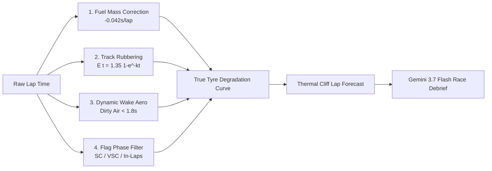

<div align="center">

# 🏎️ TrackShift AI // Motorsport Intelligence

### Real-Time Formula 1 Telemetry Noise-Cancellation, Tyre Degradation & Strategy Engine

[](https://react.dev/)
[](https://www.typescriptlang.org/)
[](https://ai.google.dev/)
[](https://tailwindcss.com/)
[](https://vitejs.dev/)
[](https://github.com/theOehrly/Fast-F1)

<p align="center">
  <b>TrackShift AI</b> is a real-time Formula 1 pit-wall strategy intelligence platform. It mathematically decomposes confounding environmental distortions—including turbulent aerodynamic wake ("dirty air"), fuel mass burn-off, and track rubbering-in—to isolate ground-truth <b>True Tyre Degradation</b>, forecast thermal tyre cliffs, and optimize compound crossover pit windows with <b>Google Gemini 3.7 Flash</b>.
</p>

[Live Demo](https://ais-pre-mdodbtdszyggiv6eo32cak-14684343425.asia-east1.run.app) • [The Problem](#-the-engineering-problem) • [Mathematical Models](#-mathematical-noise-cancellation-pipeline) • [Key Features](#-platform-modules) • [Tech Stack](#-technology-stack) • [Getting Started](#-getting-started)

---

</div>

## 📌 The Engineering Problem

In modern motorsport and Formula 1, race strategists make multi-million dollar pit-stop decisions based on raw lap times. However, **raw timing data is heavily distorted by physical noise**:

1. **Fuel Mass Burn-off**: Burning ~1.6 kg to 2.0 kg of fuel per lap sheds vehicle mass, yielding an artificial baseline speedup of **-0.035s to -0.065s per lap** that masks underlying tyre wear.
2. **Dynamic Wake Penalty ("Dirty Air")**: Running within **< 1.8s** of a leading car sheds up to 35% aerodynamic downforce, inducing severe thermal carcass overheating and adding **+0.4s to +1.2s** of artificial pace loss.
3. **Track Grip Evolution (Rubbering-In)**: Track grip increases as rubber is deposited, artificially compensating for tyre degradation by up to **1.35s** over a race stint.
4. **The False Cliff Dilemma**: Teams frequently misdiagnose traffic-induced pace drops as dead rubber (causing premature pit-stops) or fail to spot impending tyre destruction hidden by fuel burn-off.

> **Our Mission**: Deconstruct every lap time vector in real time to isolate **True Ground-Truth Pace** and make winning strategy calls.

---

## 🧮 Mathematical Noise-Cancellation Pipeline

TrackShift isolates intrinsic tyre wear through a real-time physical vector decomposition:

$$\Delta T_{\text{isolated}} = T_{\text{raw}} - \Delta T_{\text{fuel}}(t) + E_{\text{track}}(t) - \text{DWP}(\text{gap}) - \Delta T_{\text{phase}}$$



### 1. Fuel Burn Mass Correction
$$\Delta T_{\text{fuel}}(t) = (t_{\text{stint}} - 1) \times 0.042\,\text{s}$$
Compensates for the artificial lap time gained as fuel mass is exhausted.

### 2. Asphalt Rubbering-In Saturation
$$E_{\text{track}}(t) = \Delta T_{\max} \cdot \left(1 - e^{-k_{\text{evo}} \cdot t_{\text{session}}}\right)$$
Where $\Delta T_{\max} = 1.35\,\text{s}$ and $k_{\text{evo}} = 0.048$. Normalizes rubber grip back to the green circuit baseline.

### 3. Dynamic Wake Penalty (DWP)
$$\text{DWP} = \alpha_{\text{aero}} \cdot (1.8 - \text{gap})^{1.35} + \beta_{\text{thermal}} \quad (\text{for } \text{gap} \le 1.8\,\text{s})$$
Quantifies aerodynamic wake downforce deficit and thermal carcass scrub penalties.

### 4. Non-Linear Tyre Degradation & Cliff Model
$$\text{Wear}(t) = k_{\text{linear}} \cdot t + k_{\text{exp}} \cdot e^{(t - t_{\text{cliff}})}$$
Models linear surface wear transitioning into exponential carcass overheating across Soft (C4/C5), Medium (C3), and Hard (C1/C2) compounds.

---

## 🚀 Platform Modules & Features

### 1. 📡 Live Pit-Wall Strategy Dashboard
- **"Aha!" Telemetry Comparison**: Real-time dual-line visualization contrasting noisy Raw Lap Times against clean True Isolated Pace.
- **Real-Time Telemetry Stream**: Live monitoring of throttle/brake inputs, tire core & surface temperatures, remaining fuel mass, and speed traps.
- **Interactive Session Controls**: Compound switching (Soft/Medium/Hard), traffic dirty air injection, Safety Car / VSC triggers, and simulation speed adjustment (1x–10x).

### 2. 🔀 Multi-Compound Crossover Matrix
- **Pace Intersection Solver**: Real-time delta degradation curves between compounds to calculate exact crossover laps.
- **Undercut / Overcut Simulator**: Calculates net track position retention and pit-stop breakeven windows factoring in circuit transit loss (~21.5s).

### 3. 🎯 Validation Studio & Ground-Truth Benchmarking
- **Historical Telemetry Verification**: Validates isolated pace models against real Grand Prix datasets (FastF1).
- **Statistical Scoring Engine**: Computes $R^2$ (> 0.94), RMSE (< 0.18s), and MAE (< 0.12s) with residual error distribution charts.

### 4. 🎙️ AI Race Strategist & Voice Debriefs (Gemini 3.7 Flash)
- **Real-Time Tactical Radio**: Translates high-dimensional telemetry into authentic, concise pit-wall audio radio messages and strategic directives.
- **Context-Aware Strategy Guidance**: Analyzes traffic windows, undercut threats, and tire life to provide actionable pit recommendations.

### 5. 💾 Telemetry & Strategy Log Exporter
- **One-Click Export**: Download complete session telemetry, isolated pace deltas, and strategic predictions in CSV or JSON formats for offline analysis.

---

## 🛠️ Technology Stack

| Layer | Technologies |
| :--- | :--- |
| **Frontend Framework** | React 18 / 19, TypeScript, Tailwind CSS v4 |
| **UI Components & Icons** | Lucide React, Custom High-Contrast Pit-Wall Theme |
| **Data Visualization** | Chart.js 4, React-ChartJS-2, D3.js utilities |
| **Motion & Animation** | GSAP 3 (ScrollTrigger), Framer Motion (`motion/react`), Lenis Smooth Scroll |
| **AI & LLM** | Google Gemini 3.7 Flash (`@google/genai` TypeScript SDK) |
| **Audio Engine** | Web Audio API (Telemetry Beeps & Synthesized Race Engineer Audio) |
| **Backend Server** | Node.js, Express.js (TypeScript), WebSockets / SSE Telemetry Stream |
| **Telemetry Ingestion** | FastF1 Python API bridge, Custom CSV / JSON telemetry parser |
| **Build & Tooling** | Vite, esbuild, tsx |
| **Deployment** | Google Cloud Run (Containerized Linux Runtime), Google AI Studio |

---

## ⚡ Getting Started

### Prerequisites
- **Node.js** (v18.0 or higher)
- **npm** or **bun**
- *(Optional)* Gemini API Key (set `GEMINI_API_KEY` in your environment for AI Debriefs)

### Local Setup

1. **Clone the repository**:
   ```bash
   git clone https://github.com/Icey067/TrackShiftPrototype.git
   cd TrackShiftPrototype
   ```

2. **Install dependencies**:
   ```bash
   npm install
   ```

3. **Configure Environment Variables** *(Optional)*:
   ```bash
   cp .env.example .env
   # Add your GEMINI_API_KEY in .env if running standalone
   ```

4. **Launch the Development Server**:
   ```bash
   npm run dev
   ```
   > 🚀 Open **`http://localhost:3000`** in your browser to launch TrackShift AI!

5. **Build for Production**:
   ```bash
   npm run build
   npm start
   ```

---

## 🎮 How to Demo at a Hackathon

1. **Start on the Live Pit Wall**: Launch the simulation and observe the **Raw Lap Time** vs. **True Isolated Pace** dual-curve.
2. **Demonstrate Noise Isolation**: Toggle the **Dirty Air** switch on — show how raw lap time spikes by +0.8s, while the isolated pace curve correctly recognizes it as aerodynamic wake.
3. **Explore Compound Crossover**: Navigate to the **Crossover Matrix** tab to show live undercut breakeven lap calculations between Softs and Mediums.
4. **Inspect Model Accuracy**: Open the **Validation Studio** to show statistical ground-truth validation ($R^2 > 0.95$) against real Grand Prix telemetry.
5. **Trigger AI Strategist**: Click **Generate AI Debrief** to hear and read Gemini 3.7 Flash's pit-wall tactical directive.
6. **Export Data**: Click **Export Logs** to demonstrate CSV/JSON data portability for race engineering teams.

---

<div align="center">

Developed with ❤️ for Formula 1 & Motorsport Strategy Engineers.

**TrackShift AI Platform** // Ground-Truth Motorsport Intelligence

</div>
