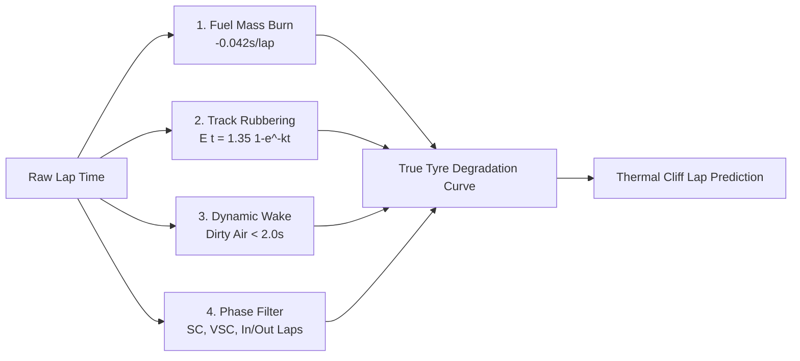

<div align="center">

# 🏎️ TrackShift // AI Motorsport Intelligence

### Real-Time Formula 1 Telemetry Noise-Cancellation & Tyre Degradation Engine

[](https://react.dev/)
[](https://www.typescriptlang.org/)
[](https://vitejs.dev/)
[](https://tailwindcss.com/)
[](https://fastapi.tiangolo.com/)
[](https://greensock.com/)
[](https://threejs.org/)

<p align="center">
  <b>TrackShift</b> is an advanced pit-wall telemetry intelligence platform designed for the 2026 Formula 1 regulations. It mathematically strips away confounding environmental variables—such as ICE fuel mass burn-off, track rubbering-in saturation, and dynamic aerodynamic wake penalties—to isolate ground-truth <b>True Tyre Degradation</b> in real time.
</p>

[Explore Live Pit Wall](#-getting-started) • [Mathematical Models](#-mathematical-noise-cancellation-pipeline) • [Platform Modules](#-platform-modules) • [Tech Stack](#-technology-stack)

---

</div>

## 📌 The Engineering Problem

In modern Formula 1 telemetry, raw lap times are inherently **noisy and misleading**:
- **Mass Burn Decay**: As the car burns ~1.7kg fuel/lap, it sheds weight and gains roughly **-0.042 seconds per lap**.
- **Track Evolution**: Rubber deposited onto the asphalt micro-texture increases grip by up to **1.35 seconds** across a stint.
- **Dynamic Wake Penalty ("Dirty Air")**: Running within **2.0s** of a leading car sheds 15%–35% front-wing downforce, causing aerodynamic understeer and surface scrub overheating.

> **Result**: A driver's raw lap times may appear constant or faster, masking severe thermal tyre degradation until the catastrophic **Tyre Cliff** causes an unexpected pace collapse.

---

## 🧮 Mathematical Noise-Cancellation Pipeline

TrackShift isolates intrinsic tyre wear through a multi-stage vector decomposition:

$$\Delta T_{\text{isolated}} = T_{\text{raw}} - \Delta T_{\text{fuel}}(t) + E_{\text{track}}(t) - \text{DWP}(\text{gap}) - \Delta T_{\text{phase}}$$



### 1. Fuel Burn Mass Correction
$$\Delta T_{\text{fuel}}(t) = (t_{\text{stint}} - 1) \times 0.042\,\text{s}$$
Re-adds the artificially gained lap time from shed vehicle mass.

### 2. Asphalt Rubbering-In Saturation
$$E_{\text{track}}(t) = \Delta T_{\max} \cdot \left(1 - e^{-k_{\text{evo}} \cdot t_{\text{session}}}\right)$$
Where $\Delta T_{\max} = 1.35\,\text{s}$ and $k_{\text{evo}} = 0.048$. Re-adds the rubbered-in asphalt grip gain to benchmark against the green track baseline.

### 3. Dynamic Wake Penalty (DWP)
$$\text{DWP} = \alpha_{\text{aero}} \cdot (2.0 - \text{gap})^{1.35} + \beta_{\text{thermal}} \quad (\text{for } \text{gap} < 2.0\,\text{s})$$
Filters out aerodynamic wake turbulence and elevated tyre carcass overheating scrub.

### 4. Pirelli 2026 Compound Wear Model
$$\text{Wear}(t) = k_{\text{linear}} \cdot t + k_{\text{exp}} \cdot e^{(t - t_{\text{cliff}})}$$
Calibrated across Pirelli **Soft (C4)**, **Medium (C3)**, **Hard (C2)**, Intermediate, and Wet compounds.

---

## 🚀 Platform Modules

### 1. 🏎️ Interactive Awwwards-Inspired Landing Experience
- **Cinematic Boot Sequence**: High-tech telemetry calibration loader with upward transition.
- **Editorial Typography**: Powered by Google Font *Aboreto* & *JetBrains Mono*.
- **Lenis Smooth Inertia Scrolling**: Butter-smooth manual wheel scrolling synchronized with GSAP ScrollTrigger.
- **Dynamic Floating Bottom Dock**: Responsive menu with quick jump links and an embedded tabbed **Engineer Authentication & 1-Click Demo Portal**.
- **4-Stage Sticky Pillars**: Interactive sticky full-screen cards detailing the core vehicle dynamics modules.

### 2. 📡 Live Pit-Wall Strategy Dashboard
- **Hero Stats Grid**: Live isolated true pace, delta vs. raw time, fuel remaining, dirty air telemetry, and tyre cliff warning badges.
- **Aha Telemetry Chart**: Real-time dual-line comparison of Raw Lap Times vs. True Isolated Pace with dynamic cliff lap indicators.
- **Math Decomposition Breakdown**: Real-time numerical deconstruction of Fuel $\Delta t$, Track Rubbering $\Delta t$, Wake Penalty $\Delta t$, and Noise Reduction Purity (%).
- **Interactive Pit-Wall Controls**: Switch tyre compounds on the fly, inject traffic/dirty air, trigger Safety Car / VSC / Yellow flags, step through laps manually, and adjust simulation speeds (1x–10x).

### 3. 🎯 Post-Race Validation Studio
- **Statistical Model Verification**: Evaluates telemetry predictions against historical Formula 1 ground truth.
- **Comprehensive Error Scoring**: Computes Mean Absolute Error (**MAE**), Root Mean Squared Error (**RMSE**), and Coefficient of Determination (**$R^2$**).
- **Thermal Cliff Precision**: Benchmarks predicted vs. actual tyre cliff laps with residual error distribution plots.

### 4. 🔀 Multi-Compound Crossover Matrix
- **Pace Intersection Analysis**: Identifies exact crossover laps where fresher or harder compounds become faster.
- **Tactical Undercut / Overcut Calculator**: Computes track position retention probability and 3-lap net time advantage including circuit pit-lane transit loss.

---

## 🛠️ Technology Stack

| Layer | Technologies |
| :--- | :--- |
| **Frontend UI** | React 19, TypeScript, Tailwind CSS v4, Motion / Framer Motion, Lucide Icons |
| **Data Visualization** | Chart.js 4, React-ChartJS-2 |
| **Animations & WebGL** | GSAP 3 (ScrollTrigger), Lenis Smooth Scroll, Three.js, React Three Fiber, Drei |
| **Backend & Real-Time** | Node.js Express Server (`server.ts`), WebSockets (`ws`), tsx |
| **Physics Simulation** | Python 3.12, FastAPI, NumPy (Vectorized dynamics), Uvicorn |

---

## ⚡ Getting Started

### Prerequisites
- **Node.js** (v18.0 or higher)
- **npm** or **bun**
- *(Optional for Python engine)* **Python 3.10+**

### Installation

1. **Clone the repository**:
   ```bash
   git clone https://github.com/Icey067/TrackShiftPrototype.git
   cd TrackShiftPrototype
   ```

2. **Install Node dependencies**:
   ```bash
   npm install
   ```

3. **Start the Unified Development Server**:
   ```bash
   npm run dev
   ```
   > 🚀 Open **`http://localhost:3000`** in your browser to launch TrackShift!

### *(Optional) Running the Python FastAPI Engine*:
```bash
uvicorn backend.main:app --port 8000 --reload
```

---

## 🎮 Live Pit-Wall Quick Access
1. Open the landing page at `http://localhost:3000`.
2. Click **"ENTER LIVE PIT WALL"** or click the bottom **MENU** dock and hit **"INSTANT DEMO"**.
3. Seamlessly transition into the Pit-Wall Strategy Dashboard with active telemetry streams.

---

<div align="center">

Developed with ❤️ for Formula 1 Race Strategy & Telemetry Engineering Enthusiasts.

**TrackShift Platform** // FIA 2026 Regulations Compliant

</div>
